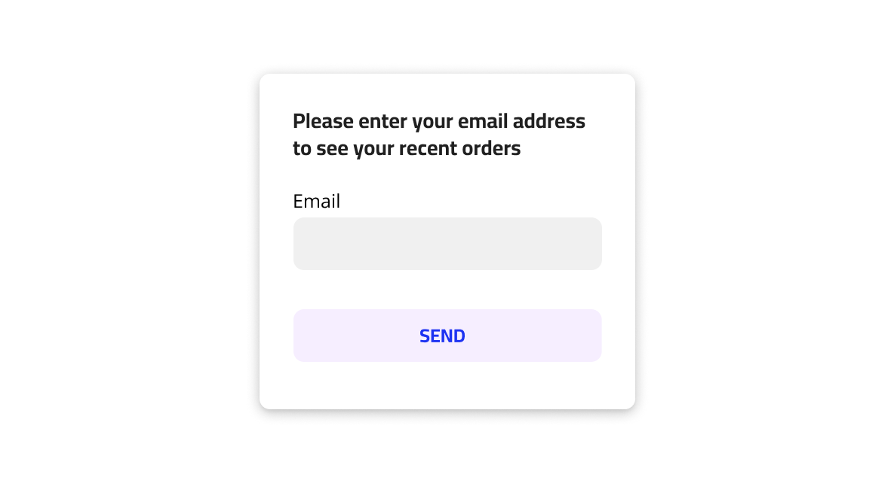
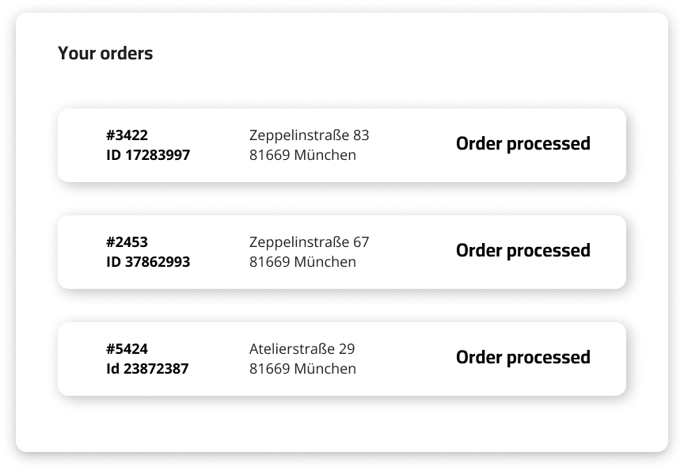
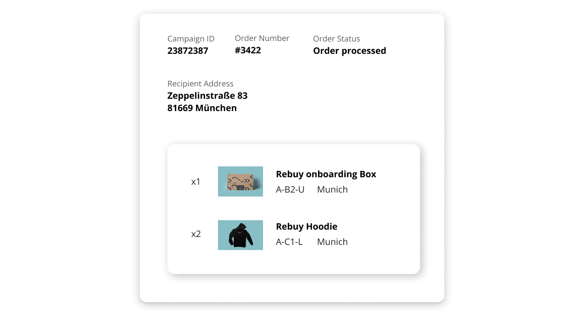

# LocalHeroBox Fullstack Engineer Quest

Welcome to the lost Fullstack Engineer Repository.
You've probably come a long way - join me around the campfire, make yourself a coffee and take a break - before you start your quest.  
Take your time and read this markdown parchment carefully, it will help you on your mission to become a Fullstack Engineer at LocalHeroBox.

## Scenario
At LocalHeroBox we integrate with a variety of marketing, sales & HR-tools. One of the more common tasks for us is to process those different data sources, analyse and combine them and serve them to one our users in a human readable and convenient way.

In this scenario, you are developer at LocalHeroBox and you are tasked with building a website that displays the orders, included campaigns and their articles for a specific user. Therefore you will need to build a frontend that presents this data to the user and a backend that serves the data to the frontend.

## Our Expectations
You might be wondering after reading the below scenario, how much effort and time we expect you to invest in this task. We know that you likely have a job, a life, further open job applications and other things that require some of your valuable time. Therefore you should **not** **spend more than** **3-4 hours** on this task. 

Just for you to have a understanding about the scope we expect, here a list for each level you might be applying for:

### Junior Developer:
- your application works without the need of modifications
- you use Python or Javascript for the task
- someone looking at the code knows what you tried to accomplish because you stick with the "Clean Code" principles

### Midlevel Developer:
- all of the above plus:
- functional programming is endorsed
- the code base is "Clean Code" by the book
- your Backend is able to handle a bigger number of requests (by e.g. using a proper Database)

### Senior Developer:
- all of the above plus:
- show us your TDD knowledge
- follow the SOLID principles

The most important thing to us is to see **how you approach the below problem and how you end up designing the backend and frontend** for it. The outcome of this task will then be used in the follow-up interview, in which we will review the code with you together and have a more in-depth discussion about your design decisions and their possible issues and improvement possibilities. Most important of all, **do not stress it**. You can only achieve a certain amount within the mentioned time frame. **Your code will likely not be perfect**, but as long as it's runnable and is able to support the basic user flow, it will be enough for us to have a technical conversation with you about it.

If anything of the below task is unclear or you struggle with some aspects of it, please do not hesitate to reach out to us. It's very important to us to keep on improving our interview task and experience, so any feedback is highly appreciated.

## How to setup your repository
For setting up your project for this challenge there are 2 ways:
- You can simply fork this repository and add your code in here. Afterwards just createa PR and send us the link.
- If you do not feel confortable to do this in a public repository, you can [just duplicate this repository](https://docs.github.com/en/repositories/creating-and-managing-repositories/duplicating-a-repository) and send us an invitation to it.

## Frontend part
The web frontend can be created with any framework you like or no framework at all. Choose what works best for you in this scenario. At LocalHeroBox we're using React, but this isn't a requirement.

The overall user flow of the frontend should be similar to the following:

### Screen 1
The user should be able to enter their email address into a form to request a list of all their orders.

### Screen 2
After submitting the form, the user will be presented with a list of all their orders, the delivery address of that order and the articles of the order.

### Screen 3
If the user chooses to click on one of the presented orders in the list, they will be presented with a detailed view of the order, including campaign and article information.

> ☝ Above mockups are just an inspiration. The final design and what you want to display to the user is up to you - do not overdo it - we just want to see how you tackle the task and what your coding style is like 😏

## Backend part
The data that the frontend is displaying needs to be served by some sort of API. The design of that API is completely up to you. Feel free to decide on the type of API (REST, SOAP, GraphQL, freestyle), endpoints, request and response types. Use what you feel most comfortable with or what you think is best suited for this kind of scenario.

## Data Sources
> ☝ Please do **not** edit the content of the below files. It's up to you, how or what information you want to store in your API, but do read the files as they are without modifying them first.

- [data/recipients.csv](./data/recipients.csv)
- [data/campaigns.csv](./data/campaigns.csv)

### recipients.csv
The SaaS Startup LocalTest-Startup, has provided us with a CSV that contains recipient details of their only and most valued customer - our CEO Sebastian 🙂

If you open the `recipients.csv` file you will see it contains multiple entries with following properties:

- `orderNo` - the order number of one of the orders that Julian submitted
- `street` - the street and house number of the recipient
- `zip_code` - the ZIP / postal code of the recipient
- `city` - the city of the recipient
- `destination_country_iso3` - the ISO3 country code of the recipient
- `email` - the email address of the recipient
- `campaignId` - the Id of the campaign, that should be send
- `orderStatus` - the initial order status of this order

### campaigns.csv
In addition to the recipient details, LocalTest-Startup has created some campaigns that should be triggered and send to the recipients. Fortunately they are in the same file format as the `recipients.csv`. 

If you open the `campaigns.csv` file you will see it contains multiple entries. Each entry represents a article of the specified campaign. If a campaign has multiple entries, then this means the campaign includes multiple articles for that specific campaign. 

Each row will contain the following properties:

- `campaignId` - the Id of the campaign, that should be send and identifies the campaign in the LocalHeroBox system
- `articleNo` - the LocalHeroBox article number of the article that is being shipped to the recipient
- `articleImageUrl` - a picture URL of the article
- `quantity` - the quantity of the article within the campaign
- `product_name` - the name of the article
- `warehouse` - the location of the warehouse where the article is stored

## What you will need
For setting up the website / frontend you can just set up a standard React/Vue/Svelte... project with the transpiler of your choice or don't use any framework at all. Choose the tool you like. (Hint - we are fans of functional programming and react hooks 😏)

For the backend you can also use a programming language or framework of your choice. At LocalheroBox we're mostly using Node.js and Python, but ultimately use what you're most comfortable with. 

If you're done with this challenge, simply send us a link to a repository that we can access - or create a PR to this repository. 

## In the end you should have
- [ ]  a website (frontend)
    - [ ]  that has 3 views
        - [ ]  email address input form
        - [ ]  order history view
        - [ ]  order detail view
    - [ ]  that fetches data from your backend API
    - [ ]  that upon entering a known email address of a user will present you with the order history related to that email address and allows you to view order details
- [ ]  an API (backend)
    - [ ]  that parses and processes the provided CSV files' content
    - [ ]  that serves content to the frontend via created endpoint(s) in a format of your choice

## What really makes us happy 😍
- [ ]  You provide us with a README.md that explains how we can run your app
- [ ]  Your code is well structured, clean and readable
- [ ]  You add comments and documentation, if your code isn't self-explanatory
- [ ]  You handle any common errors that could occur
- [ ]  You use automated tests where appropriate

## That is it - everything else is up to you! Happy coding!
